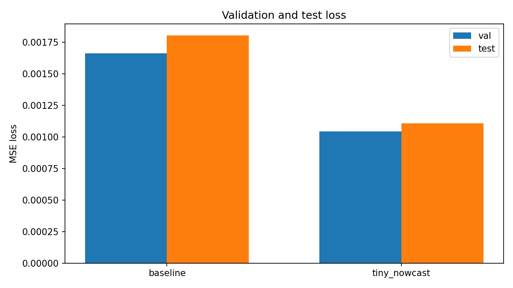
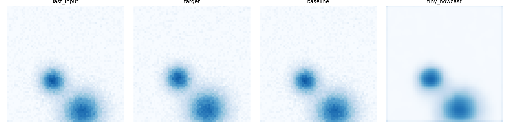

# Tiny Nowcast

Minimal precipitation nowcasting project built on synthetic data.

The repo contains:
- `src/generate_data.py`: creates moving Gaussian blob sequences and saves `train/val/test` splits into `data/synth_data.npz`
- `src/train.py`: trains `TinyNowcastModel`
- `src/test.py`: evaluates the baseline and trained model, then saves plots and metrics into `outputs/`
- `src/pipeline.py`: runs data generation, training, and evaluation end to end with one shared seed

## Quick start

Install dependencies:

```bash
python3 -m venv .venv
./.venv/bin/pip install -r requirements.txt
```

Run the full pipeline:

```bash
./.venv/bin/python src/pipeline.py
```

Run evaluation only:

```bash
./.venv/bin/python src/test.py --data-path data/synth_data.npz --model-path models/tiny_nowcast_model.pth --output-dir outputs
```

## Results

Metrics from `outputs/metrics.txt` using the latest `models/tiny_nowcast_model.pth` checkpoint:

| Model | Val MSE | Val MAE | Test MSE | Test MAE |
| --- | ---: | ---: | ---: | ---: |
| Baseline | 0.001664 | 0.026043 | 0.001807 | 0.026930 |
| TinyNowcast | 0.001045 | 0.021251 | 0.001108 | 0.021715 |

On this checkpoint, `TinyNowcast` outperforms the last-frame baseline on both splits.

## Artifacts

Loss comparison:



Qualitative predictions:


